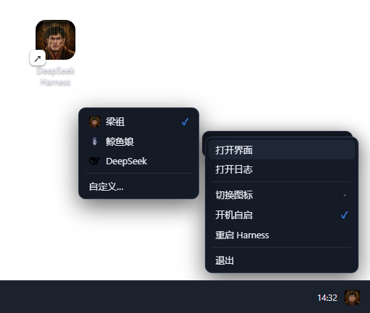

# dsh-tray-launcher

<p align="center">
  
  &nbsp;
  
  &nbsp;
  
  &nbsp;
  
  &nbsp;
  
</p>

<p align="center">
  <strong>DeepSeek Harness 的 Windows 桌面托盘启动器</strong><br>
  <em>双击快捷方式无窗口启动 dsh web · 系统托盘常驻 · 退出即全退 · 一行命令安装</em>
</p>

<div align="center">

[是什么](#是什么) · [功能特性](#功能特性) · [界面预览](#界面预览) · [快速开始](#快速开始) · [使用](#使用) · [配置](#配置) · [卸载](#卸载) · [常见问题](#常见问题) · [已知限制](#已知限制)

</div>

## 是什么

DeepSeek Harness（dsh）默认在终端里前台运行 `dsh web`——必须留着一个 cmd/PowerShell 窗口，误关窗口服务就没了。本工具把它变成**一个标准的 Windows 托盘应用**：双击桌面快捷方式，无任何窗口弹出，托盘出现图标，harness 就绪后自动打开浏览器；托盘菜单管理界面与日志，「退出」即完整停止（先停 harness、再关托盘，不留后台残留）。

> 这不是 dsh 的 cordis 插件，而是 dsh 在 Windows 上的启动/常驻工具：不改 dsh 源码，不接管 dsh 的升级与多 profile 能力，卸载即还原。

| | 终端直跑 `dsh web` | 本工具（托盘） |
| --- | --- | --- |
| 启动方式 | 手动开终端敲命令 | 双击桌面快捷方式 |
| 窗口 | cmd 常驻（误关即停） | 无窗口，托盘图标常驻 |
| 打开界面 | 手动敲浏览器地址 | 端口就绪自动打开 |
| 停止方式 | Ctrl+C / 关窗口 | 托盘右键「退出」（全退） |
| 日志 | 窗口里翻 | 落盘 + 托盘菜单一键打开 |
| 重复启动 | 端口冲突报错 | 单实例锁，自动唤起已有界面 |

## 功能特性

- 🚫 **无窗口启动**：不弹 cmd/控制台，harness 后台运行，stdout/stderr 落盘日志
- 🖥️ **系统托盘常驻**：托盘图标 + 气泡提示（正在启动 / 已在运行 / 已停止），harness 意外退出自动收起
- 👆 **托盘菜单**：打开界面 / 打开日志 / 退出（= 停止 harness + 关托盘）；双击图标 = 打开界面
- 🌐 **就绪自动开浏览器**：后台轮询端口，harness 一监听就自动打开 Web GUI
- 🔒 **单实例保护**：互斥锁 + 端口检测，重复双击快捷方式不会重复启动，只会唤起界面
- 🔍 **自动定位 dsh**：配置文件 → npm 全局 → npx 缓存逐级探测，找不到才报错；也可手动指定
- 🎨 **多图标 + 右键切换**：预设**梁祖 / 鲸鱼娘 / DeepSeek** 三款图标，托盘右键「切换图标」一键更换，**托盘与桌面快捷方式图标同步更新**；也支持「自定义…」选择任意 `.ico`
- 🚀 **可选开机自启**：安装时 `-Autostart` 注册；也可随时在托盘右键「开机自启」一键开关
- 🩺 **控制台模式兜底**：`launch.bat` 前台运行、日志直出窗口，排查问题时用

## 界面预览

桌面快捷方式 → 无窗口启动 → 托盘图标常驻（右键菜单：打开界面 / 打开日志 / 切换图标 / 开机自启 / 重启 Harness / 退出），harness 就绪自动打开浏览器：



## 快速开始

### 系统要求

- Windows 10 / 11
- Windows PowerShell 5.1（系统自带，无需安装）
- 已安装 DeepSeek Harness CLI（`dsh web` 可正常启动）与 Node.js（dsh 自身要求 ≥ 22，安装本工具需要 ≥ 18）

### npm 全局安装（推荐）

```powershell
npm install -g dsh-tray-launcher
dsh-tray-install
```

安装器会自动检测 dsh 与 node 位置，**安装前会列出将执行的操作并询问确认**（回车 = 继续，输入 n 取消）；找不到 dsh 时会提示你粘贴 `bin.js` 路径，也可用 `dsh-tray-install -DshPath "<bin.js 路径>"` 手动指定。自动化场景用 `-Yes` 跳过确认。

之后日常使用：

```powershell
dsh-tray
dsh-tray --console
```

`dsh-tray` 为托盘模式（无窗口），`dsh-tray --console` 为控制台模式（日志直出终端）。

### 一行命令远程安装

```powershell
powershell -NoProfile -ExecutionPolicy Bypass -Command "irm 'https://raw.githubusercontent.com/fancr-code/dsh-tray-launcher/main/install.ps1' -OutFile $env:TEMP\dshtray-install.ps1; & $env:TEMP\dshtray-install.ps1"
```

安装器自动检测 dsh 与 node 位置，**安装前会列出将执行的操作并询问确认**（回车 = 继续，输入 n 取消）；找不到 dsh 时会提示你粘贴 `bin.js` 路径，也可用 `dsh-tray-install -DshPath "<bin.js 路径>"` 手动指定。自动化场景用 `-Yes` 跳过确认。

### 从仓库安装

```powershell
git clone https://github.com/fancr-code/dsh-tray-launcher.git
cd dsh-tray-launcher
powershell -NoProfile -ExecutionPolicy Bypass -File install.ps1
```

### 安装参数

| 参数 | 说明 |
| --- | --- |
| `-DshPath <路径>` | 手动指定 dsh CLI 入口（`@deepseek-ai/dsh/lib/bin.js`），自动检测失败时使用 |
| `-Icon <xxx.ico>` | 托盘 + 快捷方式图标；不传使用仓库自带的梁祖图标 |
| `-ShortcutName <名称>` | 桌面快捷方式名称，默认 `DeepSeek Harness` |
| `-Autostart` | 同时注册开机自启（复制快捷方式到启动文件夹） |
| `-Yes` | 跳过安装前的确认提示（自动化场景） |
| `-DryRun` | 只检测和打印，不写入任何文件 |

示例：

```powershell
powershell -NoProfile -ExecutionPolicy Bypass -File install.ps1 -Icon D:\icons\liangzu.ico -Autostart
```

## 使用

| 操作 | 效果 |
| --- | --- |
| `dsh-tray`（或双击桌面快捷方式） | 无窗口启动；托盘出图标 + 气泡；端口就绪自动开浏览器 |
| `dsh-tray --console`（或双击 `launch.bat`） | 控制台模式，前台运行、日志直出终端 |
| 双击托盘图标 | 打开界面 |
| 托盘「打开界面」 | 浏览器打开 Web GUI |
| 托盘「打开日志」 | 记事本打开 stdout 日志 |
| 托盘「重启 Harness」 | 停止并重新拉起 dsh web（无窗口），就绪后自动重开浏览器 |
| 托盘「切换图标」 | 弹出子菜单：梁祖 / 鲸鱼娘 / DeepSeek / 自定义…（选择后托盘与快捷方式图标立即同步，选中项打勾） |
| 托盘「开机自启」 | 勾选状态 = 是否已注册开机自启；点击即切换（自动创建/删除启动文件夹里的快捷方式，气泡提示结果） |
| 托盘「退出」 | 停止 harness + 关闭托盘（全部退出） |
| harness 意外退出 | 气泡提示「已停止」并自动收起托盘 |

## 配置

安装器在安装目录（`%LOCALAPPDATA%\Programs\DSHTray\`）生成 `dsh-tray.config.json`，全部字段可选：

```json
{
  "dshBin":   "C:\\...\\node_modules\\@deepseek-ai\\dsh\\lib\\bin.js",
  "node":     "C:\\Program Files\\nodejs\\node.exe",
  "url":      "http://127.0.0.1:3080",
  "icon":     "liangzu",
  "shortcut": "C:\\Users\\<you>\\Desktop\\DeepSeek Harness.lnk",
  "cwd":      "C:\\Users\\<you>"
}
```

| 字段 | 说明 |
| --- | --- |
| `icon` | 图标：`liangzu`（梁祖，默认）/ `whale-girl`（鲸鱼娘）/ `deepseek`（DeepSeek 鲸鱼）/ 自定义 `.ico` 的绝对路径；托盘右键「切换图标」会写这个字段 |
| `shortcut` | 桌面快捷方式路径，切图标时用它同步快捷方式图标 |

`dshBin` / `node` 缺省时按「npm 全局 → npx 缓存 → PATH → 常见路径」顺序自动探测。日志写在安装目录 `logs\` 下（`dsh-out.log` / `dsh-err.log` / `dsh-tray.log`）。

## 卸载

**一键卸载**（本地脚本或远程执行）：

```powershell
powershell -NoProfile -ExecutionPolicy Bypass -File uninstall.ps1
```

远程执行（未安装本仓库时）：

```powershell
powershell -NoProfile -ExecutionPolicy Bypass -Command "irm 'https://raw.githubusercontent.com/fancr-code/dsh-tray-launcher/main/uninstall.ps1' -OutFile $env:TEMP\dshtray-uninstall.ps1; & $env:TEMP\dshtray-uninstall.ps1"
```

会自动：结束托盘进程 → 删除桌面快捷方式（含开机自启副本）→ 删除安装目录 `%LOCALAPPDATA%\Programs\DSHTray\`。

npm 方式安装的再执行：`npm uninstall -g dsh-tray-launcher`

## 常见问题

<details>
<summary><strong>托盘图标看不到？</strong></summary>

Windows 会把不常用的新图标收进通知区「^」折叠区，点开小箭头看看，或把图标拖到常显区。
</details>

<details>
<summary><strong>重复点快捷方式会开两个 harness 吗？</strong></summary>

不会。托盘脚本带单实例互斥锁，第二个实例只会唤起已有界面后退出。
</details>

<details>
<summary><strong>报「未找到 dsh CLI」？</strong></summary>

用 `install.ps1 -DshPath <bin.js 路径>` 重新安装并手动指定；`bin.js` 一般在 `node_modules\@deepseek-ai\dsh\lib\bin.js`。
</details>

<details>
<summary><strong>想换图标？</strong></summary>

重新跑一遍安装器并传 `-Icon`；图标会同步应用到托盘与快捷方式。
</details>

<details>
<summary><strong>harness 更新后路径变了？</strong></summary>

重跑安装器即可，自动重新探测 dsh 位置并更新配置。
</details>

<details>
<summary><strong>退出托盘后 harness 还在跑？</strong></summary>

点的是「退出」才会**停止 harness 并退出托盘**（全退）。如果你之前手动结束过托盘进程、或在旧版本里用过「退出托盘」语义，请确认用的是当前版本菜单里的「退出」。
</details>

## 已知限制

- 「退出 / 停止」通过端口占用者与「命令行含 `dsh` 的 node.exe 进程」定位并结束 harness；若同时跑着其他命令行里带 `dsh` 字样的 node 进程，可能被一并结束
- 单实例互斥锁在**同一用户会话**内有效；不同用户/会话可各开一套
- 端口检测依赖 `Get-NetTCPConnection`（Windows 8+ 内置），固定端口 `3080`（监听端口由 dsh 自身配置决定，本工具只负责按该端口检测）
- 仓库随附的图标素材：梁祖画像源自 [liang-intensity-calibrator](https://github.com/Lichtspektrum/liang-intensity-calibrator)、鲸鱼娘帧源自 [dsh-client-ui-pet](https://github.com/xituisuany-max/dsh-client-ui-pet)、DeepSeek 鲸鱼 logo 为 DeepSeek 官方标识——均仅作图标随工具分发，若版权方要求移除，开 issue 将立即处理
- 本工具只负责启动/常驻，不接管 dsh 的升级、多 profile 等能力

## 许可

MIT © 2026 fancr-code

## 致谢

托盘形态与无窗口化思路参考了社区各类 dsh 桌面工具的实践；随附图标素材：梁祖画像来自 [liang-intensity-calibrator](https://github.com/Lichtspektrum/liang-intensity-calibrator)、鲸鱼娘帧来自 [dsh-client-ui-pet](https://github.com/xituisuany-max/dsh-client-ui-pet)、DeepSeek 鲸鱼 logo 为官方标识（画像资产归原作者，见「已知限制」）。
